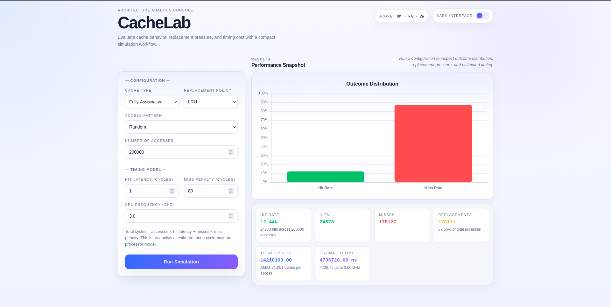
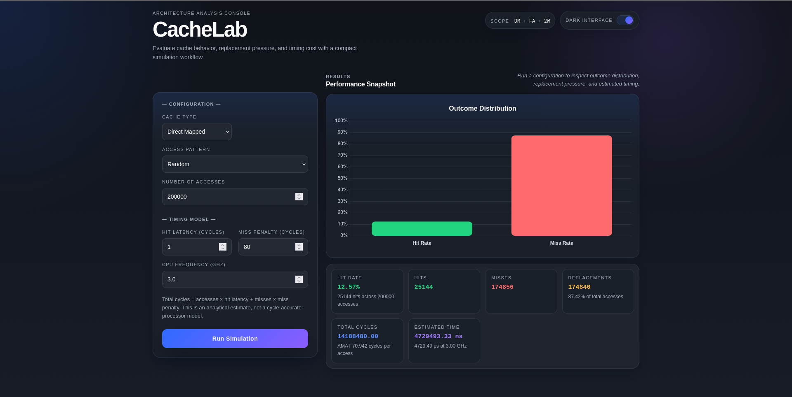

# CacheLab — Interactive Cache Architecture Simulator

CacheLab is an interactive computer architecture simulation tool designed to analyze and visualize cache behavior under different memory access patterns.

It was developed as a personal project to deepen my understanding of memory hierarchy and cache performance through implementation and experimentation beyond coursework.

## What this project explores

This simulator explores how different cache design choices affect system performance through controlled experiments involving architecture, memory access patterns, and replacement strategies.

It focuses on:

- How direct-mapped, fully associative, and set-associative caches behave in practice
- How memory access patterns influence cache hit rate and performance
- How replacement policies affect cache efficiency
- How architectural decisions translate into overall system performance

## Features

- Simulation of multiple cache architectures (Direct-Mapped, Fully Associative, Set-Associative)
- Support for LRU, FIFO, and Random replacement policies
- Predefined memory access patterns for workload analysis
- Interactive browser-based interface for experimentation
- Quantitative performance evaluation using hit rate, miss rate, and AMAT

## Performance model

CacheLab uses a simplified performance model based on cycle estimation to compute:

- Total cycles
- Average Memory Access Time (AMAT)
- Estimated execution time

This model is intended for educational purposes rather than cycle-accurate hardware simulation.


## Access patterns

The simulator includes synthetic workloads designed to stress different cache behaviors:

- Random: unpredictable memory access
- Sequential: linear memory traversal
- FourStrike: repeated access to a small working set
- ConflictDM: stress test for direct-mapped caches
- WorkingSet64: locality-based access pattern
- StrideConflict: strided access patterns inducing cache conflicts

## Metrics

For each simulation, CacheLab reports:

- Hits and misses
- Hit rate
- Number of cache replacements
- Total cycles (estimated)
- Average Memory Access Time (AMAT)
- Estimated execution time

## System overview

The system consists of two main components:

- Backend (C++): simulation engine and HTTP API
- Frontend (HTML/JavaScript): interactive visualization and experiment control

## Why this project matters

Understanding cache behavior is essential for optimizing both hardware and software performance.

CacheLab provides an interactive environment to explore how architectural decisions impact computational efficiency in practice.

## Project Structure

```text
cache-simulator/
├── backend/
│   ├── api.cpp
│   ├── main.cpp
│   ├── simulator.cpp
│   ├── simulator.hpp
│   ├── httplib.h
│   ├── Makefile
│   └── run_tests.sh
├── web/
│   ├── index.html
│   ├── style.css
│   ├── app.js
│   └── screenshots/
└── README.md
```

- `backend/` contains the cache models, timing logic, CLI entry point, and HTTP server
- `web/` contains the frontend interface
- The frontend communicates with `http://localhost:8080/simulate`

## Running the Project

### Requirements

- `g++` with C++17 support
- `make`
- Python 3, or any simple static file server
- A modern browser

### 1. Start the backend

```bash
cd backend
make
./server
```

The API will be available at:

```text
http://localhost:8080
```

### 2. Start the frontend

```bash
cd web
python3 -m http.server 5500
```

Then open:

```text
http://localhost:5500
```

## HTTP API

The frontend sends requests to:

```text
GET /simulate
```

Example query parameters:

```text
cacheType=FA
policy=LRU
pattern=WorkingSet64
numAccesses=200000
hitLatency=1
missPenalty=80
cpuFrequencyGHz=3.0
```

Example response fields:

- `hits`
- `misses`
- `hitRate`
- `replacements`
- `hitLatency`
- `missPenalty`
- `cpuFrequencyGHz`
- `totalCycles`
- `amat`
- `estimatedTimeNs`

## CLI Usage

The backend also includes a simple command-line test binary:

```bash
cd backend
make test
./test_simulator FA LRU Sequential 1000
```

This prints the simulation summary directly in the terminal.

## Screenshots



---



## Future Improvements

- Add configurable cache size and block size in the UI
- Support write-through and write-back policies
- Add multi-level cache simulation
- Expand automated test coverage
- Support side-by-side comparison between configurations

This project was implemented as a personal engineering effort combining systems programming and computer architecture concepts.